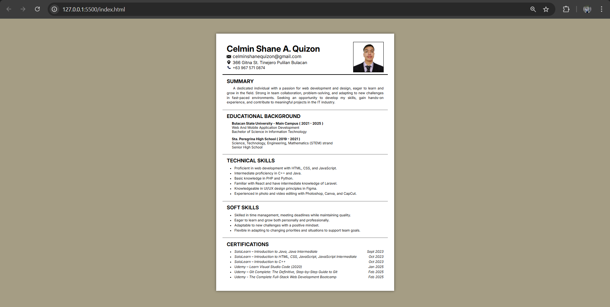

# 📄 Online Resume
A personal online resume built with `HTML` and `CSS`, showcasing my CV, skills, and certifications.

## </> Tech Stack
- HTML
- CSS

## 💡 Get Started
### 1. Clone this repository
```bash
https://github.com/clmnshn28/online-resume.git
cd online-resume
```
### 2. Start Live Server in VS Code:
- If installed: Right-click `index.html` → "Open with Live Server".
- If not installed:
    - Go to Extensions tab (Ctrl + Shift + X).
    - Search for "**Live Server**" (by Ritwick Dey), install it, then run "Open with Live Server".

### 3. ✅ Done! Your resume should now be live in the browser.

## 🔎 Overview 



## 📬 Contact
- 📧 Email: [celminshanequizon@gmail.com](mailto:celminshanequizon@gmail.com)
